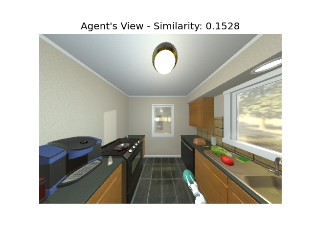
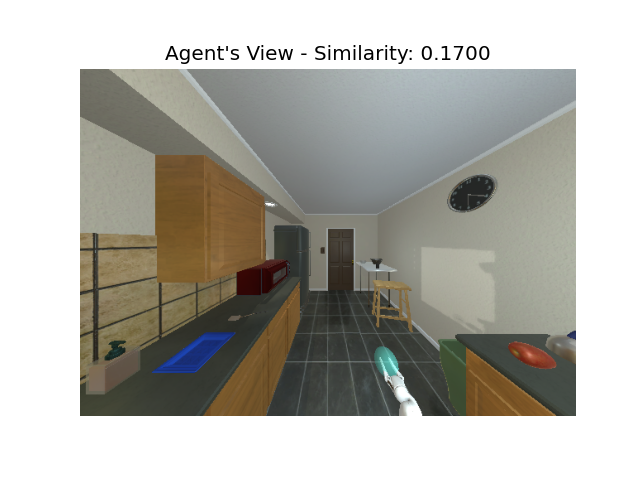

# Results of CLIP similarity

## ResNet-50 & Scene Floor Plan 11

| Scene (Image) | Instructions (Text) | Backbone (Text) |
|---|---|---|
|  | A scene of red tomato and cabbage on the table | ResNet-50 |
|  | A scene of red tomato and cabbage on the table | ResNet-50 |
|  | A scene of red tomato and cabbage on the table | ResNet-50 |
|  | A scene of red tomato and cabbage on the table | ResNet-50 |
|  | A scene of red tomato and cabbage on the table | ResNet-50 |
|  | A scene of red tomato and cabbage on the table | ResNet-50 |
|  | A scene of red tomato and cabbage on the table | ResNet-50 |
|  | A scene of red tomato and cabbage on the table | ResNet-50 |
|  | A scene of red tomato and cabbage on the table | ResNet-50 |
|  | A scene of red tomato and cabbage on the table | ResNet-50 |
|  | A scene of red tomato and cabbage on the table | ResNet-50 |
|  | A scene of red tomato and cabbage on the table | ResNet-50 |
|  | A scene of red tomato and cabbage on the table | ResNet-50 |
|  | A scene of red tomato and cabbage on the table | ResNet-50 |
|  | A scene of red tomato and cabbage on the table | ResNet-50 |
|  | A scene of apple on the table | ResNet-50 |
|  | A scene of apple on the table | ResNet-50 |
|  | A scene of apple on the table | ResNet-50 |
|  | A scene of apple on the table | ResNet-50 |
|  | A scene of apple on the table | ResNet-50 |
|  | A scene of apple on the table | ResNet-50 |
|  | A scene of apple on the table | ResNet-50 |
|  | A scene of apple on the table | ResNet-50 |
|  | A scene of apple on the table | ResNet-50 |
|  | A scene of apple on the table | ResNet-50 |
|  | A scene of apple on the table | ResNet-50 |
|  | A scene of apple on the table | ResNet-50 |
|  | A scene of apple on the table | ResNet-50 |
|  | A scene of apple on the table | ResNet-50 |
|  | A scene of apple on the table | ResNet-50 |